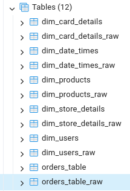

# Multinational Retail Data Centralisation
Multinational Retail Data Centralisation is a project to demonstrate data handing primarily using Python Pandas and Postgresql as presented by AiCore. The concept takes legacy data from various sources, standardises them and then stores them in a database. It has little or no loops through the data frames allowing Pandas to this work with internal functions for high performance.

## Concepts learned/demonstrated
<ul>
<li>Using lambdas/functions, masks and data series within Pandas for large scale data standardisation.
<li>Python libraries for easily handling of CSV and PDF data files.
<li>Postgresql table manipulation with SqlAlchemy.
<li>Unit testing with Python.
<li>Basic threading with Python.
<li>SQL lead function with CTE table
</ul>

## Installation Instructions / Dependancies
This project was written for Python 3 with the following libraries and their dependancies:

      - boto3==1.29.4
      - numpy==1.26.2
      - pandas==2.1.3
      - psycopg2-binary==2.9.9
      - python-dateutil==2.8.2
      - pyyaml==6.0.1
      - requests==2.31.0
      - sqlalchemy==2.0.23
      - tabula-py==2.9.0
More details can be found in the environment_configurations folder which has output from the conda environments used for both Linux Ubuntu LTS) and Windows (10) envs.
For database storage, the configuration is to use Posgresql; however, this could easily be changed to another SQL variant.

### Issue with Python 3.12
The code without flaw on Python 3.12.0; however, a submodule (JPype1) has dependencies which don't have Python 3.12 accepted yet making pip and conda installs fail. You'll see a warning appear about this with the resulting fall back to a 'subprocess'.

### Configuration Files
There are two configuration files, db_creds.yaml and api_creds.yaml which contain all the configuration for the legacy source RDS database, target database, API endpoints and credentials. For security reasons, the files are not included in this repository, but templates are provided (db_creds-template.yaml and api_creds-template.yaml) in the environment_configurations folder. After filling these templates in, save them to the project root as db_creds.yaml and api_creds.yaml.

## Usage Instructions
To execute the project, we can simply run the directory such as: 
<code>python .</code>
 

https://github.com/DanBachmann/Multinational-Retail-Data-Centralisation/assets/3606253/e70e4cab-fa30-4bae-a465-1a35d3398569

### Optional Parameters
<ul>
<li>checks - perform basic pre-requisite checks
<li>checks_extensive - Performs extensive pre-requisite checks including the basic checks.
<li>write_raw - In addition to writing the clean data to the database, write the raw data as well to the same table structure with the prefix _raw. This also includes the basic pre-requisite checks done in 'checks'
<li>Be default, all processes are run; however, any combination can be run by specifying them as:
<ul>
<li>process_users
<li>process_cards
<li>process_stores
<li>process_products
<li>process_orders
<li>process_times
</ul>
<li>do_nothing - do_nothing is specified, then no processing threads will run. This can be useful if only a pre-requisite check (options checks or checks_extensive) is desired.
</ul>
So a use with options to perform basic pre-requisite checks and process just the users and cards would look like: 
<code>python . checks process_users process_cards</code>

https://github.com/DanBachmann/Multinational-Retail-Data-Centralisation/assets/3606253/a9927149-f4aa-497e-b339-9cd708b9dfe4

### Reporting
Ad hoc reporting is done with SQL queries in a tool such as PgAdmin. The data requests for milestone 4 are in <code>
metrics_miletstone4.sql</code>
where each query can be highlighted and quickly executed.

https://github.com/DanBachmann/Multinational-Retail-Data-Centralisation/assets/3606253/fdfca68c-1929-4c1c-b782-0d0078ebc0af

## Developer Information
### Multi-threaded Architecture
Since most of the execution time is spent on downloading data, each download of data runs in separate thread. The data cleaning and saving of the clean data also run in the same thread as the downloader keeping the code easy to follow.

### File Structure
The file structure is flat with the exception of the environment_configurations folder. (see Instalation instructions above)

### Testing
Files prefix with tests_ are tests which can be run:
<ul>
<li>tests_unit - tests loading of the configuraton files
<li>tests_externals - tests all external endpoints
</ul>
All of these tests are executed when running the project with the 'checks_extensive' argument. Since this is a relativly simple project, essentially every line of code would be run with: 
<code>
python . checks_extensive write_raw</code>

Running only the processes which are being worked on will also save time for end to end testing of an isolated process. For example, if working on the orders table population: 
<code>python . process_orders</code> 
Will run just the code used to populate, clean and save the data. This also handles the removal and addition of foreign keys when any process is run.

### Data Exploration and Debugging
This exploratory.ipynb Jypiter notebook has utility classes for exploring our data to assist in the development and data cleaning processes. Beyond the basic checking of types and exploring tables on the RDS database, the write_raw option to write to an SQL database where queries can be used to explore the data is extremly valuable. 

